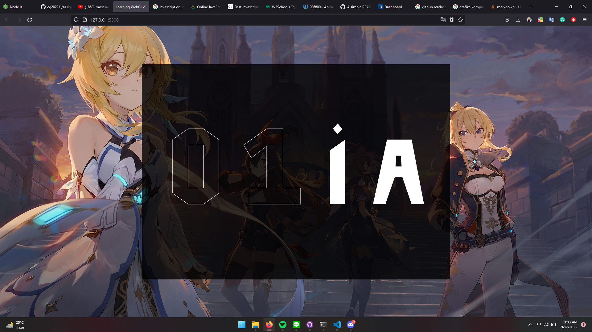
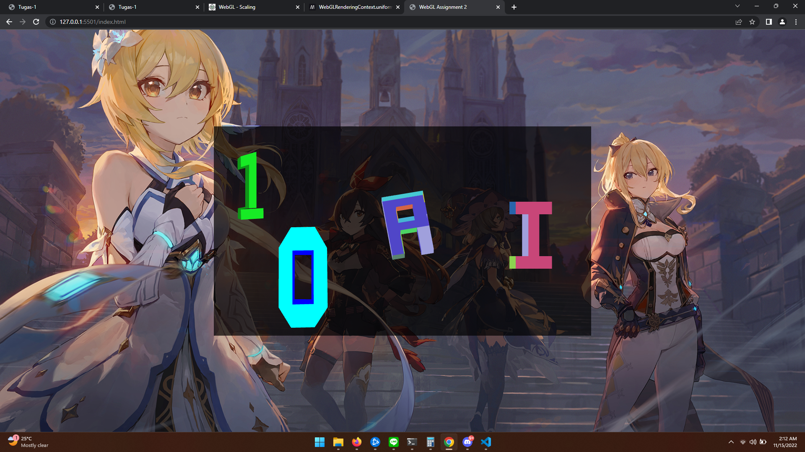

# Assignment Project 1
## Details
Name: Adam Satr<i>**ia**</i>  
NRP: 051119420000<i>**01**</i>

This is the first assignment of Computer Graphics course 2022, creating a 2d objects with _lines_ and _triangles_. Objects to be drawn are student's last two NRP digits and the last two characters of their name.

## Screenshots

# Assignment Project 2
>note: please run this assignment on chrome (firefox not working properly).

Redefine the vertices data of the two digits and two alphabets so they are extruded into 3D objects. In other words, equip the vertices data with z values. 

### Tasks:
- (Automatically) Translate the first digit object horizontally (0), bouncing back between the right and left edges of the canvas with a speed of 0.001 units per frame.
- (Automatically) Scale the second digit object, bouncing back between its half-size and double-size with a scaling speed of your choice.
- (Interactively) Rotate the first alphabet about the Y axis with an angular speed of your choice when the left or right arrow key is pressed.
- (Interactively) Rotate the second alphabet about the X axis with an angular speed of your choice when the up or down key is pressed.

## Screenshots

